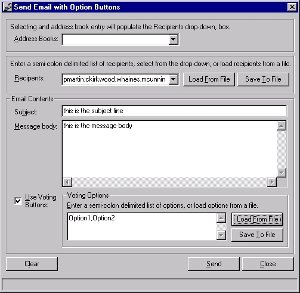



## Email by Outlook Automation with Voting Buttons

### Description

This is based on Dylan Morley's Program msOutlook Library.

I took his program and added functionality for voting buttons, storage and retrieval of recipient list/voting options, clearing of form.

I changed the interface, added error trapping, hotkeys and hourglass functionality. I didn't change any of Dylan's original code-I just added code in necessary places and added error trapping. SO you may notice a change in the variable/scope naming convention in some places.

Thanks Dylan for the start - i needed this

to help us at work figure out what we're

doing for lunch every day. Each day

i send a list of options out to my

lunch cronies, we go with the place

with the highest vote.

(note: this program uses microsoft's outlook automation library msoutl85.olb

This program also requires the Microsoft Scripting Runtime (scrrun.dll) which can be obtained by installing any one of the following packages: Windows Script Host Windows NT Option Pack Microsoft Internet Information Server 3.0 Scripting 3.1 upgrade Visual Studio 98 Visual Basic 6.0 )

Use this however you want.
 
### More Info
 

             |
---                |---
**Submitted On**   |2001-01-05 15:05:18
**By**             |[Charlie Kirkwood](https://github.com/Planet-Source-Code/PSCIndex/blob/master/ByAuthor/charlie-kirkwood.md)
**Level**          |Advanced
**User Rating**    |4.8 (24 globes from 5 users)
**Compatibility**  |VB 6\.0
**Category**       |[Complete Applications](https://github.com/Planet-Source-Code/PSCIndex/blob/master/ByCategory/complete-applications__1-27.md)
**World**          |[Visual Basic](https://github.com/Planet-Source-Code/PSCIndex/blob/master/ByWorld/visual-basic.md)
**Archive File**   |[CODE\_UPLOAD13411152001\.zip](https://github.com/Planet-Source-Code/charlie-kirkwood-email-by-outlook-automation-with-voting-buttons__1-14156/archive/master.zip)

### API Declarations

see the code

